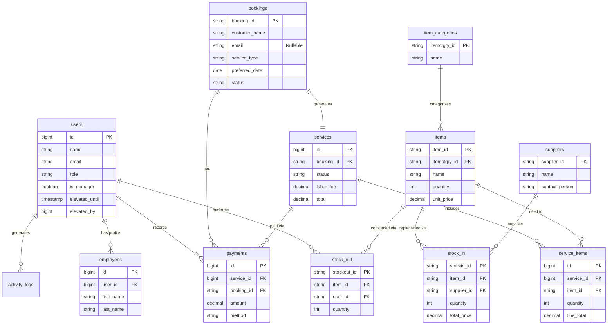

# System Documentation
**Project Name:** Inventory and Booking System

## 1. System Overview
The **Inventory and Booking System** is a web-based application designed to streamline the operations of a service-based business (e.g., Auto Shop, Repair Center). It manages the entire lifecycle of a customer transaction: from online booking and stock management to service execution and payment processing.

## 2. Key Modules
### 2.1 Authentication & Access Control
*   **Secure Login**: Role-based access control protecting the dashboard.
*   **Roles**:
    *   **Admin**: Full access to all modules, including sensitive settings (Backups, Employee Management, Reports).
    *   **Manager**: Operational access (Inventory, Services) but restricted from critical system configurations.
    *   **Indefinite Manager**: Special temporary elevation for owners/managers.

### 2.2 Dashboard
*   **Real-time Metrics**: Provides a quick snapshot of business health.
    *   Pending Bookings
    *   Services In-Progress
    *   Critical Low Stock Alerts
    *   Today's Sales Summary

### 2.3 Public Booking Portal
*   **Customer Facing**: A dedicated page (`/booking`) for clients to leverage.
*   **Features**:
    *   Select Service Type.
    *   Choose Preferred Date/Time.
    *   Prevents double-booking (basic validation).
*   **Workflow**: Customer submits -> Admin receives "Pending" Booking -> Admin creates Service/Job.

### 2.4 Service Management (Job Orders)
The core operational hub of the system.
*   **Workflow States**:
    1.  **Pending**: Service created from a booking.
    2.  **In Progress**: Mechanic/Technician starts work (Time tracking starts). *Limit: Max 10 concurrent active services.*
    3.  **Completed**: Work finished, invoice generated.
    4.  **Cancelled**: Job aborted, items returned to inventory.
*   **Parts & Labor**: Allows adding inventory items (parts) and labor fees to calculate the final Total.

### 2.5 Inventory Management
Tracks physical assets to prevent stockouts/pilferage.
*   **Item Management**: Create, Edit, Delete products/parts.
*   **Stock In**: Record new deliveries from suppliers.
*   **Stock Out**: Automatically deducts stock when used in a Service.
*   **Low Stock Alerts**: Highlights items below reorder level.

### 2.6 Transactions & Payments
*   **Payment Tracking**: Record partial or full payments.
*   **Methods**: Cash, Gcash, Bank Transfer.
*   **Receipts**: Generates digital receipts for completing services.

### 2.7 Reports
*   **Sales Reports**: Filterable views of income (Daily, Weekly, Monthly).
*   **Export**: Capability to export data for external analysis.

### 2.8 System Utilities
*   **Backup & Recovery**: Built-in tool (Railway & Local) to backup database state.
*   **Activity Logs**: tracks "Who did What" for accountability (e.g., "Admin updated Service #123").

## 3. Technology Stack
*   **Framework**: Laravel (PHP)
*   **Database**: MySQL
*   **Frontend**: Blade Templates, TailwindCSS/Custom CSS
*   **Deployment**: Compatible with Railway/Render (Dockerized).

## 4. User Guide Highlights
> **How to process a customer:**
> 1. Check **Bookings** for new requests.
> 2. Open the Booking and click **"Create Service"**.
> 3. Add the **parts** needed for the car/repair.
> 4. Click **"Check In"** (In Progress) when work starts.
> 5. When finished, enter **Labor Fee** and click **"Check Out"** (Completed).
> 6. Go to **Payments** tab to record the cash received.

## 5. Entity Relationship Diagram (ERD)

